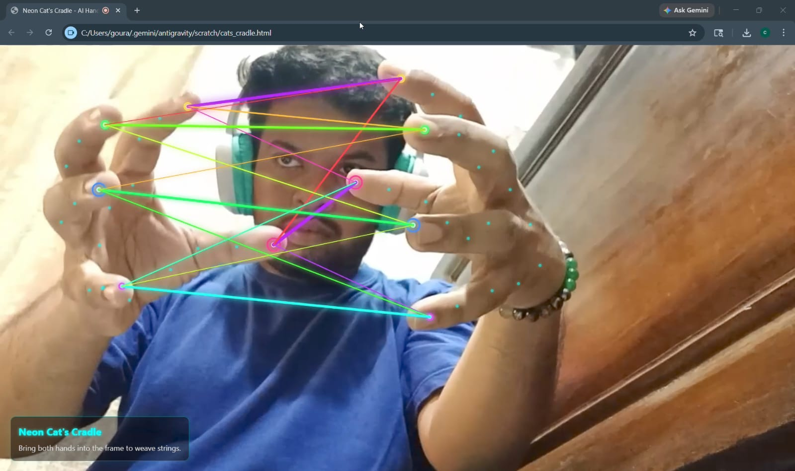

# ✨ Neon Hand Weaver

An interactive AI-powered web experience that transforms your hands into glowing neon string art in real time.

Using computer vision and hand tracking, this project connects your fingertips with vibrant animated lines to create a futuristic Cat's Cradle effect directly in the browser.

---

## 📸 Preview



---

## 🌟 Features

- ✋ Real-time hand tracking
- 🌈 Dynamic neon strings between fingertips
- ✨ Glowing effects and starbursts
- 🪞 Mirror-style webcam interaction
- 📱 Responsive full-screen design
- ⚡ Runs entirely in the browser

---

## 🛠️ Built With

- HTML5
- CSS3
- JavaScript
- MediaPipe Hands
- p5.js

---

## 📂 Project Structure

```text
neon-hand-weaver/
├── cats_cradle.html
├── screenshot.jpeg
├── README.md
└── LICENSE
```

---

## 🚀 Getting Started

### Clone the Repository

```bash
git clone https://github.com/gourab354/neon-hand-weaver.git
cd neon-hand-weaver
```

### Run the Project

Open `cats_cradle.html` in your browser and allow camera access.

---

## 🎮 How It Works

1. Detects up to two hands using MediaPipe Hands.
2. Tracks fingertip positions in real time.
3. Connects fingertips with glowing neon lines.
4. Draws cross-connections to create woven patterns.
5. Displays starburst effects when fingertips come close.

---

## 🌐 Live Demo

You can deploy this project using:

- GitHub Pages
- Netlify
- Vercel

---

## 📄 License

This project is licensed under the MIT License.

---

## 👨‍💻 Author

**Gourab**

Electronics enthusiast, robotics developer, and creative coder passionate about building futuristic interactive experiences.

---

## ⭐ Support

If you like this project, please give it a ⭐ on GitHub and share it with others.
